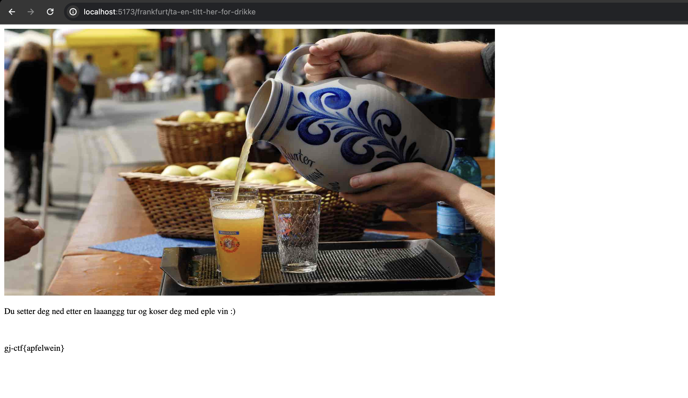

# Hvordan finne alle flaggene i Germany Julian-CTF

Dette er en veiledning for de som prøver seg på JJ-CTF'en. Flaggene ligger noen ganger litt godt gjemt og det er noen feller å gå i.
Men hvis du følger denne til punkt og prikke så skal det gå lett som en plett, og du kan finne alle sammen.

## Flagget til Berlin

Når du kommer til hjemmesiden så naviger deg til Berlin siden, ved å trykke på den blå Berlin linken.
Du ser ingenting med en gang du kommer inn, men hvis du markerer hele siden, så kommer det opp en hemmelig beskjed.

Du kan også finne beskjeden ved å gå til inspekt og lete deg fram i koden til beskjeden.
Her står det at du skal sjekke console.log, og når du gjør det så kommer det noe interessant opp.

Her ser vi at det er en string som er kryptert, som vi kan enda sikkrere vite på grunn av settningen ovenfor som hinter til at den er kryptert med B64.
Vi kopierer koden inn i en B64 krypterer. Jeg bruker dcode sin, men du kan bruke hvilke som helst.
Og da får vi dette flagget:

Da er det bare å legge den inn i Berlin eiendel på hjemmesiden og da er det første flagget ferdig :)

## Flagget til Frankfurt

Dette flagget er litt mer vrient å håndtere seg med, men når du først vet om trikset, er det fikset på null komma niks.
Når du går til Frankfurt siden og prøver å markere siden skjer det ikke mye, heller ikke om du inspecter det. Men du får allerede et hint av det som står der.

Her står det at vi har gått feil, og at det er kun roboter som kan komme seg fram. Fordi det har seg nemmlig sånn at viss du skriver inn robots.txt som under mappe på hjemmesiden, så kommer det opp alle "skjulte" mapper og sider som hjelper roboter med å navigere.
Men vi kan allikevel gjøre det samme.

Her ser vi flere undermapper og sider, men vi trenger bare å bry oss om én. Det er flagget til Tokyo som vi leter etter, så da kan vi skrive inn /frankfurt/ta-en-titt-her-for-drikke inn i URL'en på hjemmesiden.

## Flagget til Mühchen

Når vi klikker oss inn på München siden så kommer det opp en rar ip adresse med en port. Setter vi den inn som URL på en nettside og bruker WireGuard med config fil så kommer denne siden opp. 

Her er det ikke noe hint, du kan gå i fellen av å analysere bildet, men der er det ingenting. Det vi ønsker å gjøre er å kjøre gobuster på denne siden. Da skriver du "gobuster dir -u "ip'en, i dette tilfellet er det 172.31.25.177:5173" -w "Ordliste som du har lastet ned og path til den fra mappe". Slik som det ser ut under

Da finner vi undermappen /attention, skriver vi URL'en inn slik "172.31.25.177:5173/attention" så finner vi det aller siste flagget og vi er ferdig med all graving og hardt arbeid :)

## Ferdig og fyll inn flagg

Da er vi straks ferdig, bare å sette inn riktig flagg i de riktig inputsa og trykke submit. Da kommer det opp et varsel om det er riktig eller ikke, og om alt er korrekt så får du en seiers vindu :)

